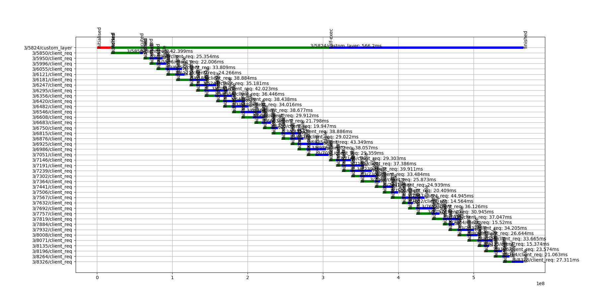
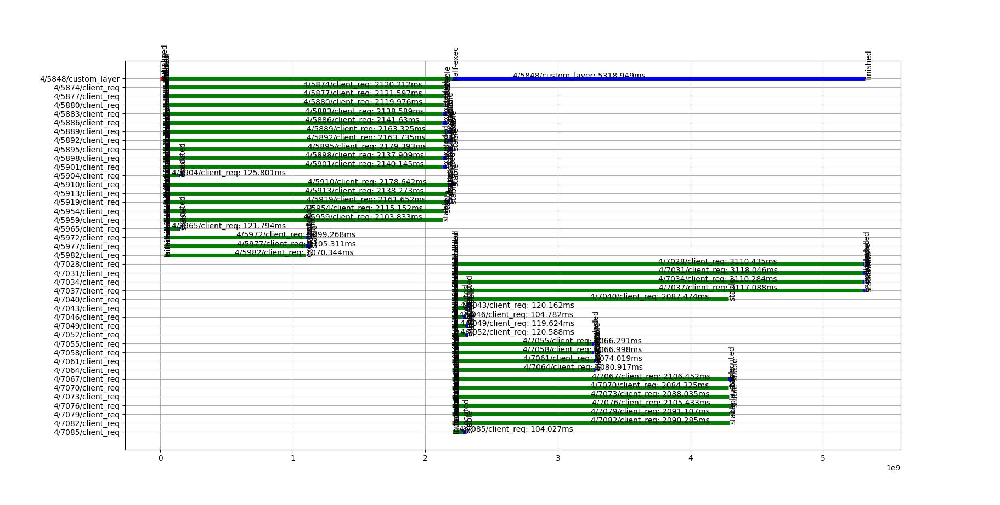
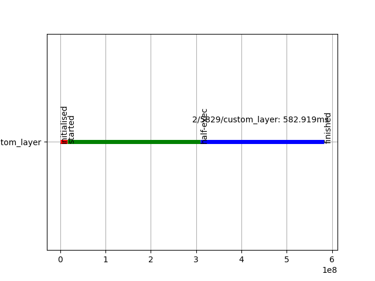
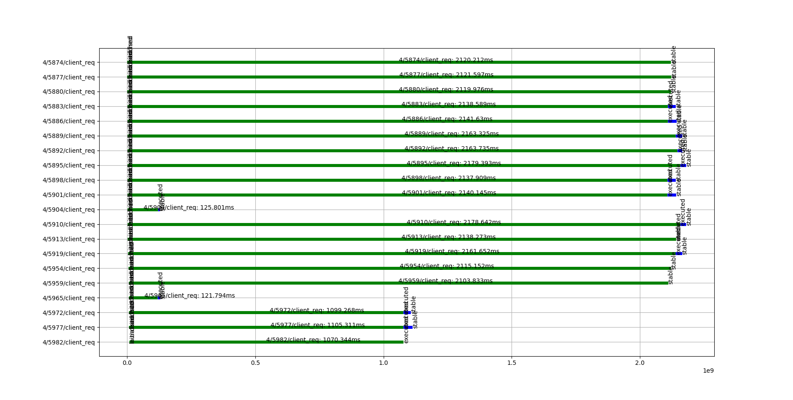

# TOC

1. Overview

2. Prerequisites

3. Problem definition

4. One-shot ADDB probe

5. Instrumenting system's layer

6. Adding relations between layers

7. Use-case: Parallel request execution

8. How to instrument without introducing new layer

# Overview

The document describes the way how to use Motr ADDB2 API functions and chronometry toolset for instrumenting Motr code and visualizing 

# Prerequisites
This document assumes the following conditions are met:

1. Motr repository is cloned and built
```
$ git clone --recursive git@github.com:Seagate/cortx-motr
$ cd cortx-motr
$ git checkout dtm/clnt/addb_basics
$ time { MAKE_OPTS=-j4 CONFIGURE_OPTS=--enable-dtm0\ --disable-altogether-mode\ --enable-debug\ --with-trace-ubuf-size=32 ./scripts/m0 rebuild || echo FAIL; }
```

2. Seagate-tools are cloned
```
$ git clone --recursive git@github.com:maximalezhin/seagate-tools.git
$ cd seagate-tools
$ git checkout addb_basics
$ cd ../
$ ln -s seagate-tools/performance/PerfLine/roles/perfline_setup/files/chronometry_v2 chronometry_v2
```

# Problem definition
Motr provides two components for logging/debugging:

- Motr trace subsystem (m0trace), as a logging subsystem.
It evaluates code execution flow.

- Motr ADDB subsystem, as "Analytic and Diagnostic Data-Base".
Purpose of addb2 sub-system is to collect information about system behaviour.

Seagate chronometry tools heavily rely on ADDB storage objects that are generated during Motr test or workload execution. System behavior can be visualized by creating sequential diagrams/timelines, drawing system queues, requests' states' histograms and so on.

Assume we have a given system test and want to evaluate system behavior. The first step to observe the system behaviour is to plot timing diagrams of the top-level request flow, or, client (former clovis) request flow. Moving from simple one-shot ADDB probes to complex layer and inter-layer relations, will help us to fix the given source code from sequential requests processing to parallel.

Sequential execution:


Parallel execution:


# One-shot ADDB probe

Commands to reproduce:
```
$ cd cortx-motr
$ rm -rf /var/motr/m0ut/
$ ./scripts/m0 run-ut -k -t idx-dix-mt:addb_probe
$ ./addb2/m0addb2dump -f /var/motr/m0ut/ut-sandbox/cs_addb_stob-27133/o/100000000000000:2 > dumps_1.txt
$ cat dumps_1.txt | grep custom
```

Output: `custom-probe1` and `custom-probe2`
```
...
* 2021-04-14-08:35:11.908730668 custom-probe1    nr: 20,     opcode: 16 |          node             <0:0> |         pid              26951 |         threa
* 2021-04-14-08:35:11.908746052 custom-probe2    state: 0 |         node             <0:0> |         pid              26951 |         thread           0 
* 2021-04-14-08:35:12.231786528 custom-probe1    nr: 20,     opcode: 17 |         node             <0:0> |         pid              26951 |         threa
* 2021-04-14-08:35:12.231799065 custom-probe2    state: 1 |         node             <0:0> |         pid              26951 |         thread           0 
* 2021-04-14-08:35:12.506909898 custom-probe2    state: 2 |         node             <0:0> |         pid              26951 |         thread           0 
...
```

Source code:
1. Add new ADDB IDs into `./addb2/identifier.h` OR into `./$component/addb.h` file
```
enum m0_addb2_value_id {
        ...
 	M0_AVI_DIX_RANGE_START     = 0xe000,
 	M0_AVI_KEM_RANGE_START     = 0xf000,
 
+	M0_AVI_CUSTOM_RANGE_START  = 0xf100,
+
+	M0_AVI_CUSTOM_PROBE1        = 0xf101,
+	M0_AVI_CUSTOM_PROBE2,
...
```

2. Add ADDB probes into your code:
```
+enum m0_custom_probe_state {
+	M0_CPS_STARTED = 0,
+	M0_CPS_HALF_EXECUTED,
+	M0_CPS_FINISHED,
+};
+
+static void st_addb_probe(void)
+{
+	uint64_t nr = 20;
+
+	idx_setup();
+	
+	M0_ADDB2_ADD(M0_AVI_CUSTOM_PROBE1, nr, M0_IC_PUT);
+	M0_ADDB2_ADD(M0_AVI_CUSTOM_PROBE2, M0_CPS_STARTED);
+	function_of_interest(nr, M0_IC_PUT);
+
+	M0_ADDB2_ADD(M0_AVI_CUSTOM_PROBE1, nr, M0_IC_DEL);
+	M0_ADDB2_ADD(M0_AVI_CUSTOM_PROBE2, M0_CPS_HALF_EXECUTED);
+	function_of_interest(nr, M0_IC_DEL);
+
+	M0_ADDB2_ADD(M0_AVI_CUSTOM_PROBE2, M0_CPS_FINISHED);
+	
+	idx_teardown();
+
+	m0_addb2_force_all();
+}
```

3. Add parsers in `./addb2/dump.c`
```
struct m0_addb2__id_intrp ids[] = {
        ...
 	{ M0_AVI_ATTR, "attr", { &dec, &attr, &skip },
 	  { "entity_id", NULL, NULL } },
 	{ M0_AVI_NODATA,          "nodata" },
+
+	{ M0_AVI_CUSTOM_PROBE1, "custom-probe1", { &dec, &dec}, { "nr", "opcode"} },
+	{ M0_AVI_CUSTOM_PROBE2, "custom-probe2", { &dec}, { "state"} },
	...
```

It's assumed that `enum m0_custom_probe_state` reflectes states of the executed test:
```
M0_CPS_STARTED
      |
      |
      V
M0_CPS_HALF_EXECUTED
      |
      |
      V
M0_CPS_FINISHED
```

Visualized data:
- N/A

Pros:
+ Very simple and fast implementation
+ Suitable for one-shoot parameters

Cons:
- No unique IDs for probes
- Timeline is N/A

# Instrumenting system's layer

Commands to reproduce:
```
$ cd cortx-motr
$ rm -rf /var/motr/m0ut/
$ ./scripts/m0 run-ut -k -t idx-dix-mt:addb_layer
$ ./addb2/m0addb2dump -f /var/motr/m0ut/ut-sandbox/cs_addb_stob-27133/o/100000000000000:2 > dumps_2.txt
$ cat dumps_2.txt | grep custom
```

Output: `custom-layer` entry has been added
```
* 2021-04-14-08:48:49.237829264 custom-layer     sm_id: 5829 o--> initialised |         node             <0:0> |         pid              27320 |         thread   $
* 2021-04-14-08:48:49.253987392 custom-layer     sm_id: 5829 initialised -[test-started]-> started |         node             <0:0> |         pid              2732$
* 2021-04-14-08:48:49.254003349 custom-probe1    nr: 20,     opcode: 16 |         node             <0:0> |         pid              27320 |         thread         $
* 2021-04-14-08:48:49.547316613 custom-layer     sm_id: 5829 started -[test-half-exec]-> half-exec |         node             <0:0> |         pid              2732$
* 2021-04-14-08:48:49.547332629 custom-probe1    nr: 20,     opcode: 17 |         node             <0:0> |         pid              27320 |         thread         $
* 2021-04-14-08:48:49.820748370 custom-layer     sm_id: 5829 half-exec -[test-finished]-> finished |         node             <0:0> |         pid              2732$
```

Visualizing data:
```
$ cd chronometry_v2
$ python3 addb2db.py --dumps /root/dev/_max/cortx-motr/dumps_2.txt --batch 50 --db m0play.db.2
$ python3 req_timelines.py -p 2 5829 -e 0 --db m0play.db.2
```



Source code:
1. Add new ADDB IDs into `./addb2/identifier.h` OR into `./$component/addb.h` file
```
enum m0_addb2_value_id {
        ...
 	M0_AVI_DIX_RANGE_START     = 0xe000,
 	M0_AVI_KEM_RANGE_START     = 0xf000,
 
+	M0_AVI_CUSTOM_RANGE_START  = 0xf100,
+
+	M0_AVI_CUSTOM_PROBE1        = 0xf101,
+	M0_AVI_CUSTOM_PROBE2,

+	M0_AVI_CUSTOM_SM_STATE,
+	M0_AVI_CUSTOM_SM_COUNTER,
+	M0_AVI_CUSTOM_SM_COUNTER_END = M0_AVI_CUSTOM_SM_COUNTER + 0x100,
...
```

2. Add the following code:
```
+/**
+ * Custom state
+ */
+enum m0_custom_state {
+	M0_CS_UNINIT,
+	M0_CS_INIT,
+	M0_CS_STARTED,
+	M0_CS_HALF_EXECUTED,
+	M0_CS_FINISHED,
+	M0_CS_NR
+};
+
+struct m0_sm_state_descr m0_custom_phases[] = {
+	[M0_CS_INIT] = {
+		.sd_flags = M0_SDF_INITIAL | M0_SDF_FINAL,
+		.sd_name = "initialised",
+		.sd_allowed = M0_BITS(M0_CS_STARTED),
+	},
+	[M0_CS_STARTED] = {
+		.sd_name = "started",
+		.sd_allowed = M0_BITS(M0_CS_HALF_EXECUTED),
+	},
+	[M0_CS_HALF_EXECUTED] = {
+		.sd_name = "half-exec",
+		.sd_allowed = M0_BITS(M0_CS_FINISHED),
+	},
+	[M0_CS_FINISHED] = {
+		.sd_flags = M0_SDF_FINAL | M0_SDF_TERMINAL,
+		.sd_name = "finished",
+	},
+};
+
+/**
+ * Textual descriptions for the valid state machine transitions.
+ */
+struct m0_sm_trans_descr m0_custom_trans[] = {
+	{"test-started", M0_CS_INIT, M0_CS_STARTED},
+	{"test-half-exec", M0_CS_STARTED, M0_CS_HALF_EXECUTED},
+	{"test-finished", M0_CS_HALF_EXECUTED, M0_CS_FINISHED},
+};
+
+/**
+ * Configuration structure for the custom operation state machine.
+ */
+struct m0_sm_conf m0_custom_sm_conf = {
+	.scf_name = "custom-conf",
+	.scf_nr_states = ARRAY_SIZE(m0_custom_phases),
+	.scf_state = m0_custom_phases,
+	.scf_trans = m0_custom_trans,
+	.scf_trans_nr = ARRAY_SIZE(m0_custom_trans),
+};
...
```

3. Don't forget to initiaze `m0_custom_sm_conf`
```
+++ b/motr/client_init.c
M0_INTERNAL int m0_client_global_init(void) 
{
        ... 
+	m0_sm_conf_init(&m0_custom_sm_conf);
+	m0_sm_addb2_init(&m0_custom_sm_conf, M0_AVI_CUSTOM_SM_STATE, 
+			 M0_AVI_CUSTOM_SM_COUNTER);
+	
 	return M0_RC(rc);
 }
```

4. Instrument your code of interest:
```
+static void st_addb_layer(void)
+{
+	struct m0_sm_group custom_grp;
+	struct m0_sm       custom_sm;
+	uint64_t           nr = 20;
+	
+	m0_sm_group_init(&custom_grp);
+	m0_sm_group_lock(&custom_grp);
+
+	m0_sm_init(&custom_sm, &m0_custom_sm_conf,
+		   M0_CS_INIT, &custom_grp);
+	m0_sm_addb2_counter_init(&custom_sm);
+	
+	idx_setup();
+
+	m0_sm_move(&custom_sm, 0, M0_CS_STARTED);
+
+	M0_ADDB2_ADD(M0_AVI_CUSTOM_PROBE1, nr, M0_IC_PUT);
+	function_of_interest(nr, M0_IC_PUT);
+	
+	m0_sm_move(&custom_sm, 0, M0_CS_HALF_EXECUTED);
+
+	M0_ADDB2_ADD(M0_AVI_CUSTOM_PROBE1, nr, M0_IC_DEL);
+	function_of_interest(nr, M0_IC_DEL);
+	
+	m0_sm_move(&custom_sm, 0, M0_CS_FINISHED);
+
+	idx_teardown();
+
+	m0_addb2_force_all();
+
+	m0_sm_fini(&custom_sm);
+	m0_sm_group_unlock(&custom_grp);
+	m0_sm_group_fini(&custom_grp);
+}
```

5. Add parsers in `./addb2/dump.c`
```
struct m0_addb2__id_intrp ids[] = {
        ...	
+	{ M0_AVI_CUSTOM_SM_STATE,     "custom-layer",    { &custom_state, SKIP2  } },
+	{ M0_AVI_CUSTOM_SM_COUNTER,   "",
+	  .ii_repeat = M0_AVI_CUSTOM_SM_COUNTER_END - M0_AVI_CUSTOM_SM_COUNTER,
+	  .ii_spec   = &custom_state_counter },
...
}

+extern struct m0_sm_conf m0_custom_sm_conf;
+static void custom_state(struct m0_addb2__context *ctx, const uint64_t *v,
+                     char *buf)
+{
+	sm_state(&m0_custom_sm_conf, ctx, v, buf);
+}
+
+static void custom_state_counter(struct m0_addb2__context *ctx, char *buf)
+{
+	sm_trans(&m0_custom_sm_conf, "custom-state", ctx, buf);
+}
```

6. Add new table entry in chronometry_v2/addb2db.py
```
    def __init__(self):
        self.parsers = {
            "rpc-item-id-fetch" : (ADDB2PP.p_1_to_2_rpc,   "sxid_to_rpc"),
            #            "fom-descr"         : (partial(ADDB2PP.p_yaml_translate, {}), "fom_desc"),   # fom_sm_id, fom state_sm_id
            "fom-descr"         : (ADDB2PP.p_1_to_2_fom,  "rpc_to_fom"),
            "tx-state"          : (ADDB2PP.p_sm_req,      "be_tx"),
            "fom-phase"         : (ADDB2PP.p_sm_req,      "fom_req"),
            "fom-state"         : (ADDB2PP.p_sm_req,      "fom_req_state"),
            "fom-to-tx"         : (ADDB2PP.p_1_to_2,      "fom_to_tx"),
            ...
            "s3-request-state"    : (ADDB2PP.p_sm_req,    "s3_request_state"),
            "s3-request-uid"      : (ADDB2PP.s3req_uid, "s3_request_uid"),
            
+           "custom-layer"        : (ADDB2PP.p_sm_req, "custom_layer"),
+           "custom-to-client"    : (ADDB2PP.p_1_to_2, "custom_to_client"),
        }
```

New SM instance is introduced. It has the following linear state flow:
```
	M0_CS_INIT
	     |
             V
	M0_CS_STARTED
	     |
             V
	M0_CS_HALF_EXECUTED
	     |
             V
	M0_CS_FINISHED
```

Pros:
+ Unique SM IDs
+ Support of timelines

Cons:
- Significatly more code

# Adding relations between layers

Commands to reproduce:
```
$ cd cortx-motr
$ rm -rf /var/motr/m0ut/
$ ./scripts/m0 run-ut -k -t idx-dix-mt:addb_relation
$ ./addb2/m0addb2dump -f /var/motr/m0ut/ut-sandbox/cs_addb_stob-/o/100000000000000:2 > dumps_3.txt
$ cat dumps_3.txt | grep custom
```

Output:

Note: `custom-to-client` is added. It linkes upper-layer SM ID with next-layer SM ID

```
...
* 2021-04-14-09:57:17.448512579 custom-layer     sm_id: 5824 o--> initialised |         node             <0:0> |         pid              28980 |         thread           0 
* 2021-04-14-09:57:17.466907222 custom-layer     sm_id: 5824 initialised -[test-started]-> started |         node             <0:0> |         pid              28980 |         thread           0 
* 2021-04-14-09:57:17.466920435 custom-probe1    nr: 20,     opcode: 16 |         node             <0:0> |         pid              28980 |         thread           0 
* 2021-04-14-09:57:17.467096403 custom-to-client custom_id: 5824, client_id: 5850 |         node             <0:0> |         pid              28980 |         thread           0 
* 2021-04-14-09:57:17.510228057 custom-to-client custom_id: 5824, client_id: 5950 |         node             <0:0> |         pid              28980 |         thread           0 
...
* 2021-04-14-09:57:17.571288632 custom-to-client custom_id: 5824, client_id: 6247 |         node             <0:0> |         pid              28980 |         thread           0 
* 2021-04-14-09:57:17.714598863 custom-to-client custom_id: 5824, client_id: 6986 |         node             <0:0> |         pid              28980 |         thread           0 
* 2021-04-14-09:57:17.726836545 custom-to-client custom_id: 5824, client_id: 7051 |         node             <0:0> |         pid              28980 |         thread           0 
* 2021-04-14-09:57:17.756264838 custom-layer     sm_id: 5824 started -[test-half-exec]-> half-exec |         node             <0:0> |         pid              28980 |         thread           0 
* 2021-04-14-09:57:17.756282998 custom-probe1    nr: 20,     opcode: 17 |         node             <0:0> |         pid              28980 |         thread           0 
* 2021-04-14-09:57:17.756438047 custom-to-client custom_id: 5824, client_id: 7146 |         node             <0:0> |         pid              28980 |         thread           0 
* 2021-04-14-09:57:17.765856468 custom-to-client custom_id: 5824, client_id: 7191 |         node             <0:0> |         pid              28980 |         thread           0 
...
```

Visualizing data:
```
$ cd chronometry_v2
$ python3 addb2db.py --dumps /root/dev/_max/cortx-motr/dumps_3.txt --batch 50 --db m0play.db.3
$ python3 req_timelines.py -p 3 5824 -e 0 --db m0play.db.3
```


Source code:
1. Add new ADDB IDs into `./addb2/identifier.h` OR into `./$component/addb.h` file
```
enum m0_addb2_value_id {
        ...
+	M0_AVI_CUSTOM_TO_CLIENT, 
        ...
```

2. Add following code:
```
+static void function_of_interest2(uint64_t nr, enum m0_idx_opcode opcode,
+				  struct m0_sm *upper_layer_sm)
{
	struct m0_op      **ops;
	...
+	/* Execute the ops */
+	for (i = 0; i < nr; ++i) {
         	...
+		rc = m0_idx_op(idx, opcode, &key_vecs[i],
+			       opcode == M0_IC_DEL ? NULL : &vals,
+			       &rcs[i], flags, &ops[i]);
+		M0_UT_ASSERT(rc == 0);
+		m0_op_launch(&ops[i], 1);
+
+		custom_to_client_map(upper_layer_sm, ops[i]);
        ...
}

+static void custom_to_client_map(const struct m0_sm *custom_sm,
+				 const struct m0_op *op)
+{
+	uint64_t custom_id = m0_sm_id_get(custom_sm);
+	uint64_t client_id = m0_sm_id_get(&op->op_sm);
+	M0_ADDB2_ADD(M0_AVI_CUSTOM_TO_CLIENT, custom_id, client_id);
+}

+static void st_addb_relation(void)
+{
        ...
+	function_of_interest2(nr, M0_IC_PUT, &custom_sm);
        ...
}

```

3. Add parsers in `./addb2/dump.c`
```
+	{ M0_AVI_CUSTOM_TO_CLIENT,      "custom-to-client", { &dec, &dec },
+	  { "custom_id", "client_id" } },
```

4. Add parser to chronometry_v2 addb2db.py:
```
    def __init__(self):
        self.parsers = {
            "rpc-item-id-fetch" : (ADDB2PP.p_1_to_2_rpc,   "sxid_to_rpc"),
            #            "fom-descr"         : (partial(ADDB2PP.p_yaml_translate, {}), "fom_desc"),   # fom_sm_id, fom state_sm_id
            "fom-descr"         : (ADDB2PP.p_1_to_2_fom,  "rpc_to_fom"),
            "tx-state"          : (ADDB2PP.p_sm_req,      "be_tx"),
            "fom-phase"         : (ADDB2PP.p_sm_req,      "fom_req"),
            "fom-state"         : (ADDB2PP.p_sm_req,      "fom_req_state"),
            "fom-to-tx"         : (ADDB2PP.p_1_to_2,      "fom_to_tx"),
            ...
            "s3-request-state"    : (ADDB2PP.p_sm_req,    "s3_request_state"),
            "s3-request-uid"      : (ADDB2PP.s3req_uid, "s3_request_uid"),
            
+           "custom-layer"        : (ADDB2PP.p_sm_req, "custom_layer"),
+           "custom-to-client"    : (ADDB2PP.p_1_to_2, "custom_to_client"),
        }
```

# Use-case: Parallel request execution

Commands to reproduce:
```
$ cd cortx-motr
$ rm -rf /var/motr/m0ut/
$ ./scripts/m0 run-ut -k -t idx-dix-mt:addb_parallel
$ ./addb2/m0addb2dump -f /var/motr/m0ut/ut-sandbox/cs_addb_stob-/o/100000000000000:2 > dumps_4.txt
$ cat dumps_4.txt | grep custom
```

Visualizing data:
$ cd chronometry_v2
$ python3 addb2db.py --dumps /root/dev/_max/cortx-motr/dumps_4.txt --batch 50 --db m0play.db.4
$ python3 req_timelines.py -p 3 5824 -e 0 --db m0play.db.4


Source code:
```
+static void function_of_interest2(uint64_t nr, enum m0_idx_opcode opcode,
+				  struct m0_sm *upper_layer_sm)
+{
+	struct m0_idx      *idx = &duc.duc_idx;
+	struct m0_op      **ops;
+	struct m0_op       *op = NULL;
+	int                *rcs;
+	struct m0_bufvec   *key_vecs;
+	char               *val = NULL;
+	struct m0_bufvec    vals = {};
+	m0_bcount_t         len = 1;
+	int                 flags = 0;
+	uint64_t            i;
+	int                 rc;
+
+	M0_PRE(M0_IN(opcode, (M0_IC_PUT, M0_IC_DEL)));
+	M0_ALLOC_ARR(ops, nr);
+	M0_UT_ASSERT(ops != NULL);
+	M0_ALLOC_ARR(rcs, nr);
+	M0_UT_ASSERT(rcs != NULL);
+	M0_ALLOC_ARR(key_vecs, nr);
+	M0_UT_ASSERT(key_vecs != NULL);
+
+	if (opcode == M0_IC_PUT) {
+		val = m0_strdup("ItIsAValue");
+		M0_UT_ASSERT(val != NULL);
+		vals = M0_BUFVEC_INIT_BUF((void **) &val, &len);
+	}
+
+	/* Execute the ops */
+	for (i = 0; i < nr; ++i) {
+		rc = m0_bufvec_alloc(&key_vecs[i], 1, sizeof(i));
+		M0_UT_ASSERT(key_vecs[i].ov_vec.v_count[0] == sizeof(i));
+		memcpy(key_vecs[i].ov_buf[0], &i, sizeof(i));
+
+		rc = m0_idx_op(idx, opcode, &key_vecs[i],
+			       opcode == M0_IC_DEL ? NULL : &vals,
+			       &rcs[i], flags, &ops[i]);
+		M0_UT_ASSERT(rc == 0);
+		m0_op_launch(&ops[i], 1);
+
+		custom_to_client_map(upper_layer_sm, ops[i]);
+		
-		rc = m0_op_wait(ops[i], M0_BITS(M0_OS_EXECUTED), WAIT_TIMEOUT);
-		M0_LOG(M0_DEBUG, "Got executed %" PRIu64, i);
-		if (rc == -ESRCH)
-			M0_UT_ASSERT(ops[i]->op_sm.sm_state == M0_OS_STABLE);
+	}
+
+	/* Wait until they get stable */
+	for (i = 0; i < nr; ++i) {
+		op = ops[i];
+		rc = m0_op_wait(op, M0_BITS(M0_OS_STABLE), WAIT_TIMEOUT);
+		M0_LOG(M0_DEBUG, "Got stable %" PRIu64,i);
+		M0_UT_ASSERT(rc == 0);
+		M0_UT_ASSERT(op->op_rc == 0);
+		M0_UT_ASSERT(rcs[0] == 0);
+		m0_op_fini(op);
+		m0_op_free(op);
+		ops[i] = NULL;
+		op = NULL;
+		m0_bufvec_free(&key_vecs[i]);
+	}
+
+	m0_free(key_vecs);
+	m0_free(ops);
+	m0_free(val);
+}
```

# How to instrument without introducing new layer

Let's take a look into ADDB records classification. 

m0play.db internals

1. Request (another name is layer).
Each request record shows ONE state, that layer's request is in.
Examples: `custom-layer`, `client-req`, ``

Request is identified by a tuple (pid, id)
```
class request(BaseModel):
    time    = IntegerField()
    pid     = IntegerField()
    id      = IntegerField()
    state   = TextField()
    type_id = TextField()
```

For each pair of (pid, id) gives set of tuples {(time0, state0), (time1, state1), ... (timeN, stateN)}

2. Relation.
Relations connects two request/layers together.
Examples: `custom-to-client`

```
class relation(BaseModel):
    pid1 = IntegerField()
    mid1 = IntegerField()
    pid2 = IntegerField()
    mid2 = IntegerField()
    type_id = TextField()
```

3. Attribute
Additional data of the particular request.

```
class attr(BaseModel):
    entity_id = IntegerField()
    pid       = IntegerField()
    name      = TextField()
    val       = TextField()
```

And the same structure of sqlite database:
```
[root@ssc-vm-0350 chronometry_v2]# sqlite3 m0play.db.4
SQLite version 3.7.17 2013-05-20 00:56:22
Enter ".help" for instructions
Enter SQL statements terminated with a ";"
sqlite> .schema
CREATE TABLE "attr" ("entity_id" INTEGER NOT NULL, "pid" INTEGER NOT NULL, "name" TEXT NOT NULL, "val" TEXT NOT NULL);
CREATE TABLE "host" ("pid" INTEGER NOT NULL, "hostname" TEXT NOT NULL);
CREATE TABLE "relation" ("pid1" INTEGER NOT NULL, "mid1" INTEGER NOT NULL, "pid2" INTEGER NOT NULL, "mid2" INTEGER NOT NULL, "type_id" TEXT NOT NULL);
CREATE TABLE "request" ("time" INTEGER NOT NULL, "pid" INTEGER NOT NULL, "id" INTEGER NOT NULL, "state" TEXT NOT NULL, "type_id" TEXT NOT NULL);
CREATE TABLE "s3_request_uid" ("pid" INTEGER NOT NULL, "id" INTEGER NOT NULL, "uuid" TEXT NOT NULL);
```

Having set of requests and relations, it's possible to reconstruct overall data/metadata path.

Reconstructing _ANY_ path:
Pick high level request: let's consider client_req:
```
  Request  ->    Relation   ->  Request  ->    Relation  ->  Request   ->   Relation   -> ...
-------------------------------------------------------------------------------------------------------------
client_req -> client_to_dix ->  dix_req  ->  dix_to_cas  ->  cas_req   ->  cas_to_rpc  -> ... -> fom_req -> ...
-------------------------------------------------------------------------------------------------------------
(pid, id)  -> (pid1, mid1)               -> (pid1, mid1)               -> (pid1, mid1)    ...
              (pid2, mid2)  -> (pid, id)    (pid2, mid2) -> (pid, id)     (pid2, mid2) -> ...
```

Meta-request can be created and executed:
```
[root@ssc-vm-0350 chronometry_v2]# sqlite3 m0play.db.4 

sqlite> select distinct(type_id) from relation;
rpc_to_fom
rpc_to_sxid
tx_to_gr
fom_to_tx
sxid_to_rpc
cas_fom_to_crow_fom
dix_to_mdix
dix_to_cas
cas_to_rpc
client_to_dix
custom_to_client

sqlite>  INSERT INTO relation (pid1,mid1,pid2,mid2,type_id) select 4,-1,request.pid,id,"meta" from request join attr on request.id==attr.entity_id where name like "M0_AVI_OP_ATTR_CODE" and val="M0_IC_PUT" and state=="initialised";

sqlite> select distinct(type_id) from relation;
rpc_to_fom
rpc_to_sxid
tx_to_gr
fom_to_tx
sxid_to_rpc
cas_fom_to_crow_fom
dix_to_mdix
dix_to_cas
cas_to_rpc
client_to_dix
custom_to_client
meta

sqlite> select * from relation where type_id='meta';
4|-1|4|5874|meta
4|-1|4|5877|meta
4|-1|4|5880|meta
4|-1|4|5883|meta
4|-1|4|5886|meta
4|-1|4|5889|meta
4|-1|4|5892|meta
4|-1|4|5895|meta
4|-1|4|5898|meta
4|-1|4|5901|meta
4|-1|4|5904|meta
4|-1|4|5910|meta
4|-1|4|5913|meta
4|-1|4|5919|meta
4|-1|4|5954|meta
4|-1|4|5959|meta
4|-1|4|5965|meta
4|-1|4|5972|meta
4|-1|4|5977|meta
4|-1|4|5982|meta
```

And after addition of META relation, it can be plotted:
```
$ python3 req_timelines.py -p 4 -1 -e 1 --db m0play.db.4
```




